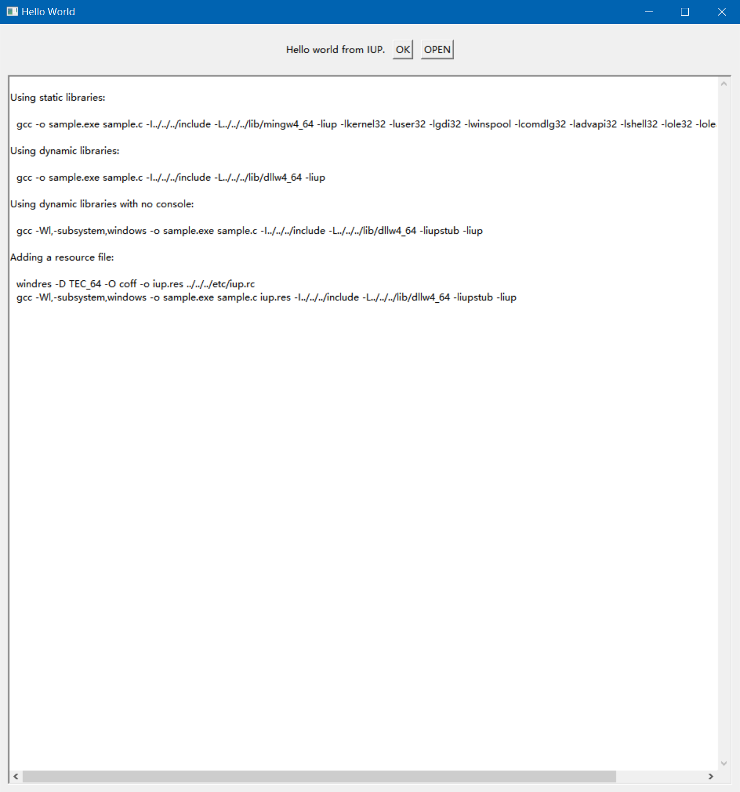

# [IUP](https://iup.sourceforge.net/)

**IUP** is a multi-platform toolkit for building graphical user interfaces. It offers a  simple API in three   basic languages: C, Lua and LED. **IUP**'s purpose is to allow a program  source code to be compiled in different systems without any modification. Its main advantages are: 

- high performance, due to the fact that it uses native interface elements.
- fast learning by the user, due to the simplicity of its API.

This work was developed at Tecgraf/PUC-Rio by means of the partnership with PETROBRAS/CENPES.

## Project Management:

Antonio Escaño Scuri

Tecgraf - Computer Graphics Technology Group, PUC-Rio, Brazil
[http://www.tecgraf.puc-rio.br/iup](http://www.tecgraf.puc-rio.br/iup)

Also available at [http://iup.sourceforge.net/](http://iup.sourceforge.net/)

## HelloWorld

```c
#include <stdio.h>
#include <stdlib.h>
#include <iup.h>

#ifndef IUP_MULTILINE
#define IUP_MULTILINE "MULTILINE"
#endif

Ihandle *multitext = NULL;

int btn_exit_cb(Ihandle *self)
{
    /* Exits the main loop */
    return IUP_CLOSE;
}

char *read_file(const char *filename)
{
    int size;
    char *str;
    FILE *file = fopen(filename, "rb");
    if (!file)
    {
        IupMessagef("Error", "Can't open file: %s", filename);
        return NULL;
    }

    /* calculate file size */
    fseek(file, 0, SEEK_END);
    size = ftell(file);
    fseek(file, 0, SEEK_SET);

    /* allocate memory for the file contents + nul terminator */
    str = malloc(size + 1);
    /* read all data at once */
    fread(str, size, 1, file);
    /* set the nul terminator */
    str[size] = 0;

    if (ferror(file))
        IupMessagef("Error", "Fail when reading from file: %s", filename);

    fclose(file);
    return str;
}

int btn_open_cb(Ihandle *self)
{
    Ihandle *filedlg = IupFileDlg();
    IupSetAttribute(filedlg, IUP_DIALOGTYPE, IUP_OPEN);
    IupSetAttribute(filedlg, IUP_EXTFILTER, "Text Files|*.txt|All Files|*.*|");

    IupPopup(filedlg, IUP_CENTER, IUP_CENTER);

    if (IupGetInt(filedlg, IUP_STATUS) != -1)
    {
        char *filename = IupGetAttribute(filedlg, IUP_VALUE);
        char *str = read_file(filename);
        if (str && multitext)
        {
            IupSetStrAttribute(multitext, IUP_VALUE, str);
            free(str);
        }
    }

    IupDestroy(filedlg);
    return IUP_DEFAULT;
}

int main(int argc, char **argv)
{
    Ihandle *dlg, *btnok, *btnopen, *label, *vbox, *hbox;

    IupOpen(&argc, &argv);

    label = IupLabel("Hello world from IUP.");
    btnok = IupButton("OK", NULL);
    btnopen = IupButton("OPEN", NULL);
    hbox = IupHbox(label, btnok, btnopen, NULL);

    IupSetAttribute(hbox, IUP_ALIGNMENT, IUP_ACENTER);
    IupSetAttribute(hbox, IUP_GAP, "10");
    IupSetAttribute(hbox, IUP_MARGIN, "10x10");

    multitext = IupText(NULL);
    IupSetAttribute(multitext, IUP_MULTILINE, IUP_YES);
    IupSetAttribute(multitext, IUP_EXPAND, IUP_YES);
    IupSetAttribute(dlg, IUP_SIZE, "x400");

    vbox = IupVbox(hbox, multitext, NULL);

    IupSetAttribute(vbox, IUP_ALIGNMENT, IUP_ACENTER);
    IupSetAttribute(vbox, IUP_GAP, "10");
    IupSetAttribute(vbox, IUP_MARGIN, "10x10");

    dlg = IupDialog(vbox);
    IupSetAttribute(dlg, IUP_TITLE, "Hello World");
    IupSetAttribute(dlg, IUP_SIZE, "640x480");

    /* Registers callbacks */
    IupSetCallback(btnok, IUP_ACTION, (Icallback)btn_exit_cb);
    IupSetCallback(btnopen, IUP_ACTION, (Icallback)btn_open_cb);

    IupShowXY(dlg, IUP_CENTER, IUP_CENTER);

    IupMainLoop();

    IupClose();
    return EXIT_SUCCESS;
}
```


